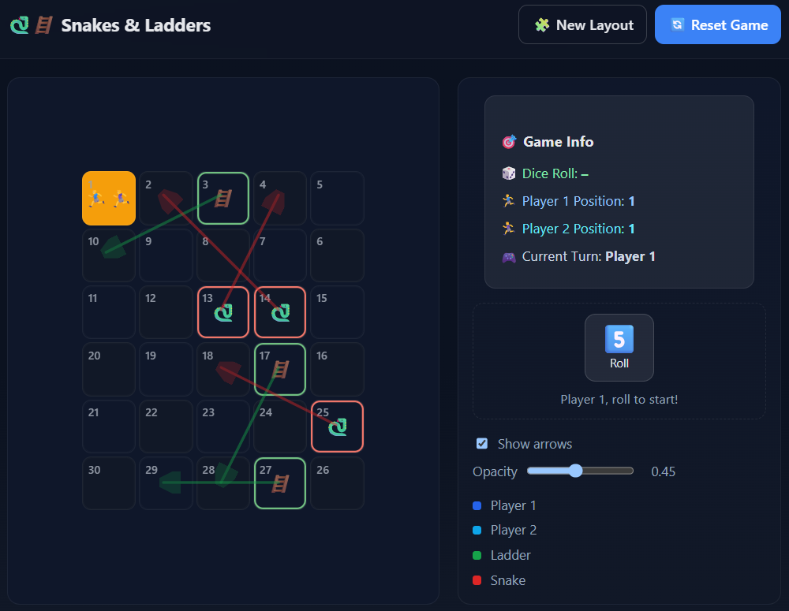

# 🐍🪜 Snakes & Ladders – React + TypeScript

An interactive, modern **Snakes & Ladders** web app built with **React**, **TypeScript**, **Vite**, and **CSS Modules**.  
Features animated dice, player turns, confetti celebration, and toggleable arrows showing snake/ladder paths.

Live demo → [your-vercel-url](https://snakes-n-ladders-rose.vercel.app/)

---

## ✨ Features

- 🎲 **Animated Dice Roller** – smooth roll animation with emoji faces  
- 🏃‍♀️ **2-Player Local Mode** – alternating turns and live position tracking  
- 🐍🪜 **Dynamic Board** – random snakes & ladders each game  
- 🧩 **New Layout / Reset** buttons  
- 🎉 **Winning Modal + Confetti**  
- 🎯 **Arrow Overlay** to visualize ladders/snakes, with adjustable opacity  
- 🌙 **Dark/Light Theme** via `prefers-color-scheme`  
- ⚡ Built with **Vite + React + TypeScript** for fast dev & hot reloads

---

## 📸 Preview



---

## 🛠️ Tech Stack

| Category | Tools |
|-----------|-------|
| Framework | [React 18](https://react.dev/) + [TypeScript](https://www.typescriptlang.org/) |
| Bundler   | [Vite](https://vitejs.dev/) |
| Styling   | CSS Modules + global tokens (`index.css`, `App.css`) |
| Deploy    | [Vercel](https://vercel.com/) |
| Animation | Custom hooks + canvas confetti (`ConfettiBurst.tsx`) |

---

## 🚀 Getting Started

### 1. Clone and install
```bash
git clone https://github.com/<your-username>/<your-repo>.git
cd <your-repo>
npm install

### 2. Run the development server
npm run dev
Then open http://localhost:5173
 in your browser.

### 3. Build for production
npm run build
npm run preview

🧩 Project Structure
src/
 ├─ App.tsx / App.css             # Root layout and main logic
 ├─ index.css / main.tsx          # Entry and global styles
 ├─ components/
 │   ├─ GameBoard.tsx / .module.css
 │   ├─ GameInfo.tsx / .module.css
 │   ├─ GameModal.tsx / .module.css
 │   ├─ DiceRoller.tsx
 │   └─ ConfettiBurst.tsx
 └─ utils/
     ├─ dice.ts
     └─ snakeLaddersRules.ts

⚙️ Environment & Scripts
Command	Description
npm run dev	Start dev server
npm run build	Build production bundle
npm run preview	Preview production build locally
npm run lint (optional)	Run linter if configured

🧠 How It Works

Board Generation: generateSnakesAndLadders() creates random snake/ladder mappings.

Movement Logic: Each dice roll updates a player's position, applying snakes/ladders via getNewPosition().

Win Condition: First to reach the last cell wins and triggers GameModal + confetti.

UI State: Controlled by React hooks (useState, useCallback).

Accessibility: Keyboard-friendly buttons, semantic roles, and aria labels.

🧪 Customization
Feature	Where to change
Board size (rows × cols)	App.tsx → ROWS, COLS constants
Snakes/ladders count	generateSnakesAndLadders(count, maxCell)
Exact-finish rule	EXACT_FINISH in App.tsx
Arrow visibility / opacity	Toggle in UI or default props in GameBoard.tsx
Confetti duration / density	Props in ConfettiBurst.tsx

🧑‍💻 Author

Vangelis Manouhos
Frontend Engineer – React | TypeScript
🔗 https://my-portfolio-ten-beta-w8rnleem6r.vercel.app/

📄 License

This project is open-source under the MIT License.